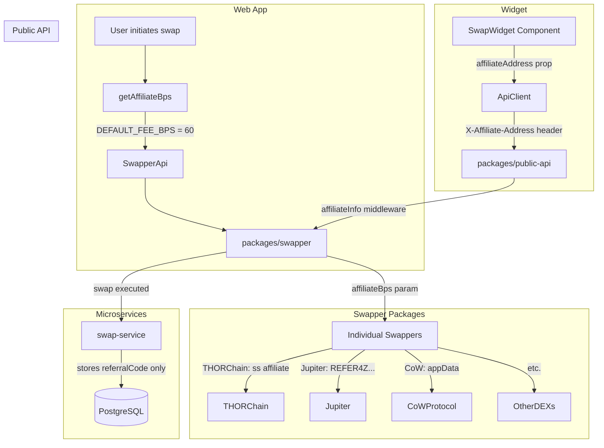

# Affiliate System Architecture

## Overview

The ShapeShift affiliate system allows partners to earn revenue share on swaps executed through their integration. This document describes the current state and proposed improvements.

## Current State

### Data Flow Diagram



### Component Details

#### 1. Web App (`src/lib/fees/`)

**Files:**
- `src/lib/fees/constant.ts` - Defines `DEFAULT_FEE_BPS = '60'` (0.6%)
- `src/lib/fees/utils.ts` - `getAffiliateBps()` function

**Logic:**
```typescript
// src/lib/fees/constant.ts
export const DEFAULT_FEE_BPS = '60' // basis points (0.6%)

// src/lib/fees/utils.ts
export const getAffiliateBps = (sellAsset: Asset, buyAsset: Asset): string => {
  // Related asset swaps (e.g., ETH → WETH) have 0 fee
  return isRelatedAssetSwap(sellAsset, buyAsset) ? '0' : DEFAULT_FEE_BPS
}
```

**Usage:**
- Called in `src/components/MultiHopTrade/hooks/useGetTradeRateInput.ts`
- Passed to `swapperApi` endpoints in `src/state/apis/swapper/swapperApi.ts`

#### 2. Widget (`packages/swap-widget/`)

**Props:**
```typescript
// packages/swap-widget/src/types/index.ts
export type SwapWidgetProps = {
  affiliateAddress?: string  // EVM address for affiliate
  // ... other props
}
```

**API Client:**
```typescript
// packages/swap-widget/src/api/client.ts
// Passes affiliateAddress to API requests
```

**Current Limitation:** Widget only passes address, cannot configure custom BPS.

#### 3. Public API (`packages/public-api/`)

**Middleware:**
```typescript
// packages/public-api/src/middleware/auth.ts
export const affiliateAddress = (req, res, next) => {
  const address = req.header('X-Affiliate-Address')
  if (address && EVM_ADDRESS_REGEX.test(address)) {
    req.affiliateInfo = { affiliateAddress: address }
  }
  next()
}
```

**Response Types:**
```typescript
// packages/public-api/src/types.ts
export type ApiRate = {
  // ...
  affiliateBps: string  // Returned in responses
}

export type RatesResponse = {
  rates: ApiRate[]
  affiliateAddress?: string  // Echo back the affiliate
}
```

**Current Limitation:** Accepts address but doesn't look up affiliate-specific BPS.

#### 4. Swapper Packages (`packages/swapper/`)

Each swapper handles affiliate fees differently:

| Swapper | Affiliate Mechanism | Config Location |
|---------|---------------------|-----------------|
| THORChain | `affiliate=ss` in memo | `THORCHAIN_AFFILIATE_NAME` |
| Mayachain | `affiliate=ssmaya` in memo | `MAYACHAIN_AFFILIATE_NAME` |
| Jupiter | `REFER4Z...` contract | `JUPITER_AFFILIATE_CONTRACT_ADDRESS` |
| CoW Protocol | `appData` JSON | Included in order |
| Butter | `shapeshift` affiliate | `BUTTERSWAP_AFFILIATE` |

**BPS Flow:**
```typescript
// packages/swapper/src/swappers/*/getTradeQuote.ts
const quote = await getQuote({
  // ...
  affiliateBps,  // Passed through to DEX APIs
})
```

#### 5. Microservices (`shapeshift/microservices`)

**swap-service:**
```typescript
// apps/swap-service/src/swaps/swaps.service.ts
async createSwap(data: CreateSwapDto) {
  // Stores referralCode (from user-service)
  // Does NOT store affiliate address or BPS
  const swap = await this.prisma.swap.create({
    data: {
      // ...
      referralCode,  // From user-service lookup
      // Missing: affiliateAddress, affiliateBps
    },
  })
}
```

**Current Limitation:** No affiliate tracking or revenue attribution.

#### 6. Affiliate Dashboard (`packages/affiliate-dashboard/`)

**Current Features:**
- Address input (no auth)
- Stats display: swaps, volume, fees
- Period filtering
- Fetches from `/v1/affiliate/stats`

**Endpoint Required:** `/v1/affiliate/stats` (needs to be implemented in microservices)

---

## Gaps Identified

### 1. No Affiliate BPS Storage
- Widget/API affiliates get whatever BPS is hardcoded
- No way to configure per-affiliate BPS
- No database table for affiliate configuration

### 2. No Swap Attribution
- Swaps are not tagged with affiliate address
- Cannot query "swaps through affiliate X"
- Revenue attribution impossible

### 3. No Partner Code System
- Cannot use friendly codes like "vultisig" or "venice"
- Must use raw wallet addresses

### 4. No Authentication
- Affiliate dashboard has no wallet auth
- Anyone can view any affiliate's stats
- Cannot update own BPS without backend

### 5. Inconsistent BPS Across Surfaces
- Web app: 60 BPS (hardcoded)
- Widget: Uses API default (should be configurable)
- Public API: No lookup, uses caller's requested BPS

---

## Proposed Solution

See [Affiliate System Alignment Spike](../beads/web-bqz.md) for full implementation plan.

### High-Level Architecture

```mermaid
flowchart TB
    subgraph "Affiliate Dashboard"
        AD[packages/affiliate-dashboard]
        AD --> |Reown wallet auth|Arbitrum
        AD --> |SIWE sign|AffiliateAPI
    end

    subgraph "Microservices"
        AffiliateAPI[/v1/affiliate/*]
        AffiliateAPI --> AffiliateTable[(affiliates table)]
        AffiliateAPI --> SwapTable[(swaps table)]
        
        AffiliateTable --> |walletAddress|Lookup
        AffiliateTable --> |partnerCode|Lookup
        AffiliateTable --> |bps|Lookup
    end

    subgraph "Public API / Widget"
        PublicApi2[X-Affiliate-Address]
        PublicApi2 --> |lookup BPS|AffiliateAPI
        PublicApi2 --> |apply correct BPS|SwapperPkg2[Swapper]
    end

    subgraph "Swap Execution"
        SwapperPkg2 --> |tag with affiliateAddress|SwapService
        SwapService --> SwapTable
    end
```

### Database Schema (Proposed)

```sql
-- affiliates table
CREATE TABLE affiliates (
  id UUID PRIMARY KEY DEFAULT gen_random_uuid(),
  wallet_address VARCHAR(42) NOT NULL UNIQUE,
  partner_code VARCHAR(32) UNIQUE,
  bps INTEGER NOT NULL DEFAULT 60,
  is_active BOOLEAN NOT NULL DEFAULT true,
  created_at TIMESTAMP NOT NULL DEFAULT NOW(),
  updated_at TIMESTAMP NOT NULL DEFAULT NOW()
);

-- Add to swaps table
ALTER TABLE swaps ADD COLUMN affiliate_address VARCHAR(42);
ALTER TABLE swaps ADD COLUMN affiliate_bps INTEGER;
```

### API Endpoints (Proposed)

```
GET  /v1/affiliate/:address        - Get affiliate config
POST /v1/affiliate                 - Register (with SIWE auth)
PATCH /v1/affiliate/:address       - Update BPS (with SIWE auth)
GET  /v1/affiliate/:address/stats  - Get swap stats
GET  /v1/affiliate/:address/swaps  - Get swap history
POST /v1/affiliate/claim-code      - Claim partner code (with SIWE auth)
GET  /v1/partner/:code             - Resolve partner code to affiliate
```

---

## Related Files

### Web App
- `src/lib/fees/constant.ts`
- `src/lib/fees/utils.ts`
- `src/state/apis/swapper/swapperApi.ts`
- `src/components/MultiHopTrade/hooks/useGetTradeRateInput.ts`

### Packages
- `packages/public-api/src/middleware/auth.ts`
- `packages/public-api/src/types.ts`
- `packages/swap-widget/src/types/index.ts`
- `packages/affiliate-dashboard/src/`

### Swapper Affiliate Constants
- `packages/swapper/src/swappers/ThorchainSwapper/constants.ts`
- `packages/swapper/src/swappers/MayachainSwapper/constants.ts`
- `packages/swapper/src/swappers/JupiterSwapper/utils/constants.ts`
- `packages/swapper/src/swappers/ButterSwap/utils/constants.ts`

### Microservices
- `apps/swap-service/src/swaps/swaps.service.ts`
- `apps/swap-service/src/swaps/swaps.controller.ts`
