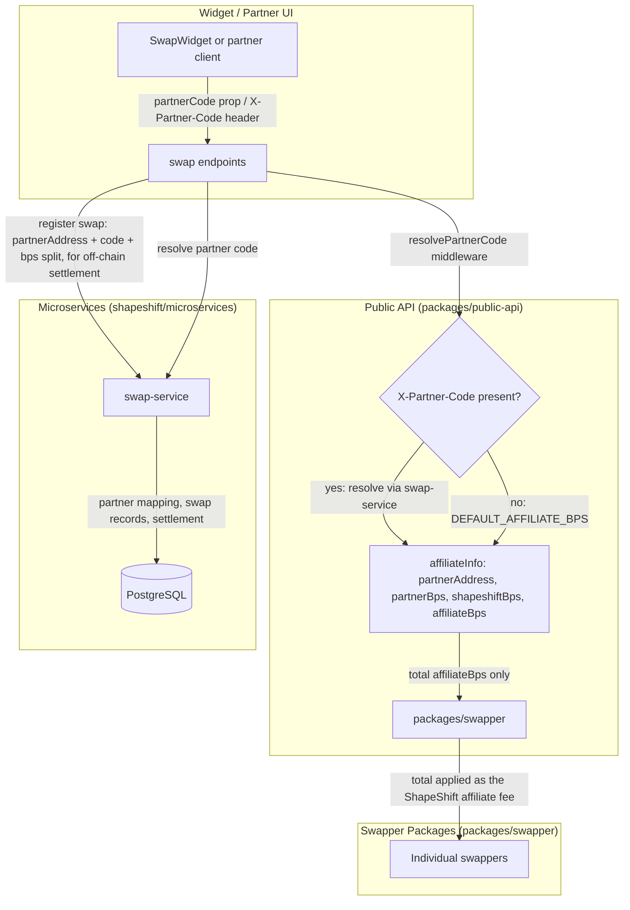

# Affiliate System Architecture

## Overview

The ShapeShift affiliate system lets partners earn revenue share on swaps executed through their
integration (Swap Widget or Public API). Attribution is keyed on a **partner code** registered to an
EVM wallet address (the partner's attribution/settlement address). This document describes the
implemented architecture.

> **Scope:** This repo (`shapeshift/web`) contains the widget, the Public API, and the swapper
> packages. Affiliate **persistence** (the affiliate registry, partner-code mapping, and swap
> records) lives in the separate `shapeshift/microservices` repo (the swap-service); that repo is
> authoritative for the database schema.

## Data Flow


```mermaid
flowchart TB
    subgraph "Widget / Partner UI"
        WG[SwapWidget or partner client]
        WG --> |partnerCode prop / X-Partner-Code header|PublicApi
    end

    subgraph "Public API (packages/public-api)"
        PublicApi[swap endpoints]
        PublicApi --> |resolvePartnerCode middleware|Resolve{X-Partner-Code present?}
        Resolve --> |yes: resolve via swap-service|AffiliateInfo[affiliateInfo: partnerAddress, partnerBps, shapeshiftBps, affiliateBps]
        Resolve --> |no: DEFAULT_AFFILIATE_BPS|AffiliateInfo
        AffiliateInfo --> |total affiliateBps only|SwapperPkg[packages/swapper]
    end

    subgraph "Swapper Packages (packages/swapper)"
        SwapperPkg --> |total applied as the ShapeShift affiliate fee|Swappers[Individual swappers]
    end

    subgraph "Microservices (shapeshift/microservices)"
        MS[swap-service]
        MS --> |partner mapping, swap records, settlement|DB[(PostgreSQL)]
    end

    PublicApi --> |register swap: partnerAddress + code + bps split, for off-chain settlement|MS
    PublicApi --> |resolve partner code|MS
```

## Attribution model

The key distinction: the swap charges a **single on-chain affiliate fee** — the **total**
`affiliateBps` — collected by ShapeShift's own affiliate accounts via each protocol's mechanism. The
`partnerBps` / `shapeshiftBps` breakdown and the `partnerAddress` are **attribution metadata**, not
separate on-chain fees:

- Only the **total** `affiliateBps` is passed to the swapper (`req.affiliateInfo.affiliateBps`). The
  `partnerAddress` and the bps split are **never** sent to the swapper, so the partner is **not** paid
  on-chain.
- The split + partner address travel to the swap-service when the swap is registered, where they back
  reporting (`/v1/affiliate/stats`, `/v1/affiliate/swaps`) and **off-chain revenue-share settlement**
  to the partner.
- `affiliateBps = partnerBps + shapeshiftBps`. With no resolvable partner code the swap is
  unattributed: `partnerBps` is absent and `affiliateBps = shapeshiftBps = DEFAULT_AFFILIATE_BPS`.

## Components

### 1. Widget (`packages/swap-widget/`)

The widget takes a single `partnerCode` prop and forwards it to the Public API as the
`X-Partner-Code` header (via its internal API client). There is no affiliate-address or bps prop —
fee configuration is resolved server-side from the partner code. See the
[widget README](../../packages/swap-widget/README.md).

### 2. Public API (`packages/public-api/`)

**Partner-code middleware** — `resolvePartnerCode` runs on the swap endpoints
(`/v1/swap/rates`, `/v1/swap/quote`, `/v1/swap/status`):

```typescript
// packages/public-api/src/middleware/auth.ts
export const resolvePartnerCode = async (req, _res, next) => {
  const partnerCode = req.header('X-Partner-Code')

  if (partnerCode) {
    const resolved = await resolvePartnerCodeFromService(partnerCode) // -> swap-service /v1/partner/:code
    if (resolved) {
      req.affiliateInfo = {
        partnerAddress: resolved.partnerAddress,
        partnerBps: resolved.partnerBps,
        shapeshiftBps: resolved.shapeshiftBps,
        affiliateBps: String(Number(resolved.partnerBps) + Number(resolved.shapeshiftBps)),
        partnerCode,
      }
      return next()
    }
  }

  // No (or unresolvable) partner code — unattributed swap uses the default fee
  req.affiliateInfo = {
    shapeshiftBps: env.DEFAULT_AFFILIATE_BPS,
    affiliateBps: env.DEFAULT_AFFILIATE_BPS,
  }
  next()
}
```

**Bps fields** — rate, quote, and status responses carry the fee breakdown:

```typescript
// packages/public-api/src/types.ts (BpsFields)
affiliateBps: string   // total fee charged on-chain, in bps
partnerBps?: string    // partner's attributed share (present when attributed)
shapeshiftBps: string  // ShapeShift's attributed share
```

These reflect the [attribution model](#attribution-model) above: `affiliateBps` is the fee actually
charged; `partnerBps` / `shapeshiftBps` describe how it is attributed for settlement.

**Swap registration** — when a swap is bound to a tx (first `GET /v1/swap/status` with a `txHash`),
the Public API registers it with the swap-service, forwarding the `partnerCode`, `partnerAddress`,
and the `partnerBps` / `shapeshiftBps` / `affiliateBps` breakdown so attribution can be persisted and
settled (see `routes/status/utils.ts`).

### 3. Swapper Packages (`packages/swapper/`)

Only the total `affiliateBps` (partner + ShapeShift) reaches the swapper. Each swapper applies it as
**ShapeShift's own** affiliate fee using that protocol's mechanism; the partner address is not
involved at this layer. Protocol-specific affiliate constants live under
`packages/swapper/src/swappers/*/`.

### 4. Microservices (`shapeshift/microservices`)

The swap-service owns affiliate persistence: the partner-code → affiliate mapping resolved by
`resolvePartnerCodeFromService`, and the swap records that back the stats/swaps endpoints. The
Public API talks to it over HTTP with an API key (`SWAP_SERVICE_API_KEY`).

### 5. Affiliate Dashboard (`packages/affiliate-dashboard/`)

Partner-facing UI for registering an affiliate (wallet + SIWE sign-in), obtaining a partner code, and
viewing stats. It is the recommended way for partners to register rather than calling the
wallet-authenticated endpoints directly.

## Affiliate API Endpoints

Implemented in `packages/public-api` (see the [API reference](https://api.shapeshift.com/docs) for
full schemas):

```
GET   /v1/affiliate/stats?partnerCode=...     # aggregate stats (optional startDate/endDate)
GET   /v1/affiliate/swaps?partnerCode=...      # paginated swap history (optional startDate/endDate/limit/cursor)
GET   /v1/partner/{code}                       # resolve a partner code -> { partnerAddress, partnerBps, shapeshiftBps }
GET   /v1/affiliate/{address}                  # look up an affiliate by wallet address
POST  /v1/affiliate                            # register (SIWE-authenticated)
PATCH /v1/affiliate/{address}                  # update settings (SIWE-authenticated)
POST  /v1/auth/siwe/nonce                      # SIWE: request nonce
POST  /v1/auth/siwe/verify                     # SIWE: verify signature
```

## Related Files

### Public API

- `packages/public-api/src/middleware/auth.ts` — partner-code resolution
- `packages/public-api/src/types.ts` — `AffiliateInfo`, `BpsFields`
- `packages/public-api/src/routes/affiliate/` — stats, swaps, get/create/update affiliate
- `packages/public-api/src/routes/partner/getPartner.ts` — partner-code resolution endpoint
- `packages/public-api/src/routes/status/utils.ts` — swap registration with `partnerCode`

### Widget & Dashboard

- `packages/swap-widget/src/types/index.ts` — `SwapWidgetProps.partnerCode`
- `packages/swap-widget/src/api/client.ts` — sends `X-Partner-Code`
- `packages/affiliate-dashboard/src/`

### Swapper affiliate constants

- `packages/swapper/src/swappers/ThorchainSwapper/constants.ts` (`THORCHAIN_AFFILIATE_NAME`)
- `packages/swapper/src/swappers/MayachainSwapper/constants.ts`
- `packages/swapper/src/swappers/CowSwapper/constants.ts`

### Microservices (separate repo: `shapeshift/microservices`)

- swap-service — affiliate registry, partner-code mapping, swap records
