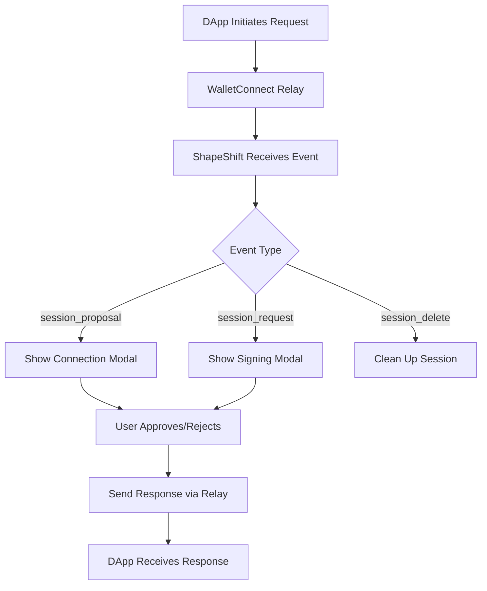

# WalletConnect dApps - Connecting ShapeShift to DApps

This document covers how [ShapeShift web](https://github.com/shapeshift/web) enables DApps to connect to it via WalletConnect v2, allowing users to interact with decentralized applications directly from ShapeShift.

## Table of Contents
- [Overview](#overview)
- [Connection Methods](#connection-methods)
- [Deep Link Handling](#deep-link-handling)
- [Session Management](#session-management)
- [Supported Request Methods](#supported-request-methods)
- [Signing Flows](#signing-flows)
- [Cross-Platform Support](#cross-platform-support)
- [Technical Architecture](#technical-architecture)
- [Security Considerations](#security-considerations)
- [Troubleshooting](#troubleshooting)

## Overview

ShapeShift can act as a WalletConnect-compatible wallet, allowing users to:
- Connect ShapeShift to any DApp that supports WalletConnect
- Sign transactions and messages
- Interact with DeFi protocols
- Maintain multiple DApp sessions simultaneously

This functionality transforms ShapeShift from just a portfolio manager into a full Web3 gateway.

## Connection Methods

### Method 1: Paste WalletConnect URI

Users can manually copy a WalletConnect URI from a DApp and paste it into ShapeShift.

**Flow:**
1. User visits a DApp (e.g., Uniswap, Aave, OpenSea)
2. DApp displays WalletConnect QR code with "Copy to clipboard" option
3. User copies the WalletConnect URI
4. In ShapeShift: Settings → WalletConnect to DApps → "Connect DApp"
5. Paste URI and connect
6. Session proposal modal appears
7. User selects accounts and chains to connect
8. Connection established

[INSERT IMAGE HERE: WalletConnect URI Paste Modal]

### Method 2: Direct Deep Link from DApp

DApps can directly open ShapeShift via deep links - the smoothest user experience.

**Flow:**
1. User visits DApp in any browser
2. Clicks "Connect Wallet" → Selects "ShapeShift" from wallet list
3. Browser redirects to `https://app.shapeshift.com/wc?uri={encodedURI}`
4. ShapeShift automatically processes the connection request
5. User approves in ShapeShift
6. Connection established

**Supported Scenarios:**
- **Desktop Browser → ShapeShift Web**: Direct navigation
- **Mobile Browser → ShapeShift Mobile**: Opens app via `shapeshift://wc?uri=...`
- **Wallet Browser → ShapeShift**: Works from MetaMask, Trust Wallet browsers

[INSERT IMAGE HERE: DApp Wallet Selection with ShapeShift Option]

### Method 3: From Wallet Integrated Browsers

Users can connect to DApps from within other wallet apps' integrated browsers.

**Example Flow (MetaMask Browser):**
1. Open MetaMask mobile app
2. Navigate to DApp in MetaMask's browser
3. Select WalletConnect → Choose "ShapeShift"
4. Redirects to ShapeShift mobile app
5. Approve connection
6. Return to MetaMask browser with ShapeShift connected

This creates an interesting scenario: using ShapeShift as the signing wallet while browsing in another wallet's browser!

## Deep Link Handling

### URI Structure

```
https://app.shapeshift.com/wc?uri={encodedWalletConnectV2Uri}

# Mobile deep link
shapeshift://wc?uri={encodedWalletConnectV2Uri}
```

### Implementation

```typescript
// src/plugins/walletConnectToDapps/hooks/useWalletConnectDeepLink.ts

export const useWalletConnectDeepLink = (state: WalletConnectState) => {
  // Extract URI from query params
  const params = new URLSearchParams(location.search)
  const encodedUri = params.get('uri')

  if (!encodedUri) {
    toast({ title: 'Invalid WalletConnect Link', status: 'error' })
    return
  }

  const uri = decodeURIComponent(encodedUri)

  // Validate WalletConnect v2 format
  if (!isWalletConnectV2Uri(uri)) {
    toast({ title: 'Invalid WalletConnect v2 URI', status: 'error' })
    return
  }

  // Process pairing
  // Note: We replace 'sessionAuthenticate' with 'sessionProposal'
  // as ShapeShift doesn't support the authentication flow
  const pairingUri = uri.replace('sessionAuthenticate', 'sessionProposal')
  await state.pair({ uri: pairingUri })
}
```

### Mobile App Routing

The [ShapeShift mobile app](https://github.com/shapeshift/mobile-app) handles deep links and routes them to the web app:

```typescript
// Mobile app deep link handler
const deepLinkHandler = ({ url }) => {
  // Extract path from shapeshift:// URL
  const path = url.split('shapeshift://')[1]

  // Route to web app with path
  const webUri = `${SHAPESHIFT_URI}/#/${path}?${Date.now()}`
  webviewRef.current?.loadUrl(webUri)
}
```

## Session Management

### Session Lifecycle

1. **Proposal**: DApp requests connection with specific chains and methods
2. **Approval**: User selects accounts and approves connection
3. **Active Session**: Ongoing connection for signing requests
4. **Updates**: Session can be updated with new chains/accounts
5. **Disconnection**: Either party can terminate the session

### Multi-Session Support

ShapeShift can maintain multiple DApp connections simultaneously:

```typescript
// Multiple active sessions stored in state
interface WalletConnectState {
  sessions: SessionTypes.Struct[]  // Array of active sessions
  activeModal?: ModalData          // Current modal being shown
  web3wallet?: IWeb3Wallet         // WalletKit instance
}
```

### Automatic Session Cleanup

Sessions are automatically cleared when users switch wallets to prevent confusion:

```typescript
// src/plugins/walletConnectToDapps/utils.ts
export const clearAllWalletConnectToDappsSessions = async () => {
  const web3wallet = getWalletConnectWallet()
  const sessions = web3wallet.getActiveSessions()

  for (const session of Object.values(sessions)) {
    await web3wallet.disconnectSession({
      topic: session.topic,
      reason: getSdkError('USER_DISCONNECTED')
    })
  }
}
```

## Supported Request Methods

### EIP155 (Ethereum & EVM Chains)

| Method | Description | Implementation |
|--------|-------------|----------------|
| `personal_sign` | Sign personal messages | Full support |
| `eth_sign` | Sign raw messages | Full support with warning |
| `eth_signTransaction` | Sign transactions | Full support |
| `eth_sendTransaction` | Sign & broadcast transactions | Full support |
| `eth_signTypedData` | Sign EIP-712 structured data | v1 not supported |
| `eth_signTypedData_v3` | Sign EIP-712 v3 | Full support |
| `eth_signTypedData_v4` | Sign EIP-712 v4 | Full support |
| `wallet_switchEthereumChain` | Switch active chain | Full support |
| `wallet_addEthereumChain` | Add new chain | Validates against supported chains |
| `wallet_getCapabilities` | Get wallet capabilities | Returns supported methods |

### Cosmos Chains

| Method | Description | Implementation |
|--------|-------------|----------------|
| `cosmos_signDirect` | Sign Cosmos Direct transactions | Full support |
| `cosmos_signAmino` | Sign Cosmos Amino transactions | Full support |

## Signing Flows

### Transaction Signing

When a DApp requests a transaction signature:

1. **Request Received**: WalletConnect emits `session_request` event
2. **Modal Display**: Transaction confirmation modal appears
3. **Simulation**: Tenderly simulates transaction (when available)
4. **User Review**: Shows gas fees, recipient, amount, contract interaction
5. **Approval/Rejection**: User decides whether to sign
6. **Response**: Result sent back to DApp via WalletConnect

[INSERT IMAGE HERE: Transaction Confirmation Modal]

### Message Signing

For message signatures (personal_sign, EIP-712):

1. **Request Parsing**: Extract and decode message
2. **Display**: Show human-readable message content
3. **Warning**: Display risks for `eth_sign` (can sign anything)
4. **Signature**: Generate signature using connected wallet
5. **Return**: Send signature back to DApp

[INSERT IMAGE HERE: Message Signing Modal]

### Multi-Step Approval Flow

The session proposal uses a multi-step modal:

```typescript
// src/plugins/walletConnectToDapps/components/modals/SessionProposal.tsx

const modalSteps = {
  overview: 'Review connection request',
  selectAccounts: 'Choose accounts to connect',
  selectNetworks: 'Select networks to enable',
  confirm: 'Approve connection'
}
```

## Cross-Platform Support

### Desktop Web

**Full Support** at `https://app.shapeshift.com`
- Direct URI pasting
- Deep link reception
- Multiple session management
- All signing methods supported

### Mobile Web

**Full Support** with caveats:
- Must be on `*.shapeshift.com` domain
- Deep links work via browser redirects
- Touch-optimized modals

### Mobile Native App

The [ShapeShift mobile app](https://github.com/shapeshift/mobile-app) provides:
- Deep link handling (`shapeshift://` and `wc://`)
- WebView integration with web app
- Native feel with web-based WalletConnect logic

### Integration Examples

**From Uniswap:**
```
1. Visit app.uniswap.org
2. Connect Wallet → WalletConnect → ShapeShift
3. Redirects to app.shapeshift.com/wc?uri=...
4. Approve in ShapeShift
5. Return to Uniswap connected
```

**From OpenSea Mobile:**
```
1. OpenSea app → Profile → Settings → WalletConnect
2. Select ShapeShift
3. Opens ShapeShift mobile app
4. Approve connection
5. Return to OpenSea
```

## Technical Architecture

### Core Components

```
src/plugins/walletConnectToDapps/
├── WalletConnectV2Provider.tsx      # Main context provider
├── eventsManager/
│   ├── useWalletConnectEventsManager.ts  # Event listener setup
│   └── useWalletConnectEventsHandler.ts  # Event processing
├── components/
│   ├── modals/
│   │   ├── SessionProposal.tsx          # Connection approval
│   │   ├── EIP155TransactionConfirmation.tsx
│   │   ├── EIP155SignMessageConfirmation.tsx
│   │   └── CosmosSignMessageConfirmation.tsx
│   └── DAppInfo.tsx                     # DApp metadata display
├── utils/
│   ├── EIP155RequestHandlerUtil.ts      # EVM request processing
│   ├── CosmosRequestHandlerUtil.ts      # Cosmos request processing
│   └── walletUtils.ts                    # Singleton instances
└── hooks/
    └── useWalletConnectDeepLink.ts      # Deep link handling
```

### State Architecture

```typescript
// Centralized WalletConnect state
interface WalletConnectState {
  core?: Core                    // WalletConnect Core instance
  web3wallet?: IWeb3Wallet       // WalletKit instance
  pair?: (params: { uri: string }) => Promise<void>
  activeModal?: ModalData        // Current modal being displayed
  sessions: SessionTypes.Struct[] // Active DApp sessions
}

// Modal data structure
interface ModalData {
  type: WalletConnectModalType
  data: SessionProposal | SignRequest | TransactionRequest
  onConfirm: () => void
  onReject: () => void
}
```

### Event Flow



### Singleton Management

WalletConnect instances are managed as singletons:

```typescript
// src/plugins/walletConnectToDapps/utils/walletUtils.ts

let walletConnectCore: Core | null = null
let walletConnectWallet: IWeb3Wallet | null = null

export const getWalletConnectCore = () => {
  if (!walletConnectCore) {
    walletConnectCore = new Core({
      projectId: WALLET_CONNECT_TO_DAPPS_PROJECT_ID,
      logger: 'error'
    })
  }
  return walletConnectCore
}

export const getWalletConnectWallet = () => {
  if (!walletConnectWallet) {
    walletConnectWallet = Web3Wallet.init({
      core: getWalletConnectCore(),
      metadata: WALLET_METADATA
    })
  }
  return walletConnectWallet
}
```

## Security Considerations

### Transaction Validation

1. **Simulation First**: Transactions simulated via Tenderly when possible
2. **Clear Display**: Show exactly what will be signed
3. **Gas Estimation**: Display estimated fees
4. **Contract Verification**: Show if interacting with verified contracts

### Message Signing Warnings

```typescript
// Special warning for eth_sign (dangerous)
if (requestMethod === 'eth_sign') {
  showWarning('This signature request can be used to sign any data, including transactions. Only sign if you trust the DApp.')
}
```

### Session Security

- **Domain Display**: Always show requesting DApp's domain
- **Permission Scope**: Only grant access to explicitly approved chains/accounts
- **Session Timeout**: Sessions can be configured with expiry
- **Revocation**: Users can disconnect sessions anytime

### Phishing Protection

1. **URI Validation**: Strict validation of WalletConnect URIs
2. **Domain Verification**: Show DApp metadata prominently
3. **No Auto-Approval**: All connections require explicit user consent

## Troubleshooting

### Common Issues

**Problem:** "DApp connection request not appearing"
- **Check:** Wallet is unlocked in ShapeShift
- **Verify:** URI is valid WalletConnect v2 format
- **Try:** Refresh and reconnect

**Problem:** "Transaction failing to sign"
- **Check:** Connected with correct account
- **Verify:** Sufficient balance for gas
- **Ensure:** Chain is supported by ShapeShift

**Problem:** "Session disconnecting randomly"
- **Cause:** Network issues or relay problems
- **Solution:** Reconnect using same method
- **Prevention:** Stable internet connection

### Debug Tools

**Enable Debug Logging:**
```typescript
// In browser console
localStorage.setItem('WALLETCONNECT_DEBUG', 'true')
```

**Check Active Sessions:**
```typescript
// In browser console
const web3wallet = window.__walletConnectWallet
console.log(web3wallet?.getActiveSessions())
```

**Monitor Events:**
```typescript
// Add to your code temporarily
web3wallet.on('session_proposal', console.log)
web3wallet.on('session_request', console.log)
```

### Testing DApp Connections

**Test DApps:**
- [WalletConnect Example DApp](https://example.walletconnect.org/)
- [Uniswap](https://app.uniswap.org/)
- [OpenSea](https://opensea.io/)
- [Aave](https://app.aave.com/)

**Testing Checklist:**
1. ✅ Connection establishes successfully
2. ✅ Correct chains and accounts shown
3. ✅ Transactions simulate properly
4. ✅ Signatures return to DApp
5. ✅ Session persists across refreshes
6. ✅ Disconnection works cleanly

## Configuration

### Environment Variables

```bash
# WalletConnect project ID for DApp connections
VITE_WALLET_CONNECT_TO_DAPPS_PROJECT_ID=your_project_id

# Feature flag to enable/disable
VITE_FEATURE_WALLET_CONNECT_TO_DAPPS_V2=true

# Custom relay URL (optional)
VITE_WALLET_CONNECT_RELAY_URL=wss://relay.walletconnect.com
```

### Metadata Configuration

```typescript
// DApp metadata shown to connecting apps
const WALLET_METADATA = {
  name: 'ShapeShift',
  description: 'A free open source platform to trade, track, buy, and earn.',
  url: 'https://app.shapeshift.com',
  icons: ['https://app.shapeshift.com/icon-512x512.png']
}
```

### Supported Chains Configuration

```typescript
// Define which chains ShapeShift supports
const SUPPORTED_CHAINS = {
  'eip155': [1, 10, 56, 100, 137, 42161, 43114, 8453, 42170],
  'cosmos': ['cosmoshub-4', 'osmosis-1', 'juno-1']
}
```

## Best Practices

### For Users

1. **Verify DApp URLs** before connecting
2. **Review transactions** carefully before signing
3. **Disconnect unused** DApp sessions regularly
4. **Use hardware wallets** for high-value transactions
5. **Keep one session** per DApp to avoid confusion

### For DApp Developers

1. **Include ShapeShift** in your wallet options
2. **Use standard methods** from EIP-1193
3. **Handle rejections** gracefully
4. **Provide clear metadata** in your DApp manifest
5. **Test with ShapeShift** before launch

## Future Enhancements

### Planned Features

1. **Batch Transaction Support**
   - Sign multiple transactions in one approval
   - Useful for complex DeFi interactions

2. **Session Templates**
   - Save common DApp connection configurations
   - Quick reconnect with saved settings

3. **Enhanced Security**
   - Hardware wallet priority for DApp connections
   - Transaction spending limits
   - Whitelist/blacklist for DApps

4. **Mobile Improvements**
   - Native WalletConnect implementation
   - Faster deep link handling
   - Background session management

### Experimental Features

- **Cross-Chain Messaging**: Support for IBC and bridge protocols
- **Smart Session Management**: Auto-disconnect inactive sessions
- **DApp Discovery**: Built-in DApp browser with featured apps

## Resources

### Documentation
- [WalletConnect v2 Specs](https://specs.walletconnect.com/2.0/)
- [WalletKit Documentation](https://docs.reown.com/walletkit/overview)
- [EIP-1193 Provider API](https://eips.ethereum.org/EIPS/eip-1193)

### Code References
- [WalletConnectV2Provider.tsx](../../src/plugins/walletConnectToDapps/WalletConnectV2Provider.tsx) - Main provider
- [useWalletConnectEventsManager.ts](../../src/plugins/walletConnectToDapps/eventsManager/useWalletConnectEventsManager.ts) - Event management
- [SessionProposal.tsx](../../src/plugins/walletConnectToDapps/components/modals/SessionProposal.tsx) - Connection UI

### Integration Support
- [WalletConnect Discord](https://discord.gg/walletconnect)
- [ShapeShift Discord](https://discord.gg/shapeshift)
- [GitHub Issues](https://github.com/shapeshift/web/issues)

---

*Last Updated: October 2025*
*Feature Status: Production Ready (Flag: `VITE_FEATURE_WALLET_CONNECT_TO_DAPPS_V2`)*