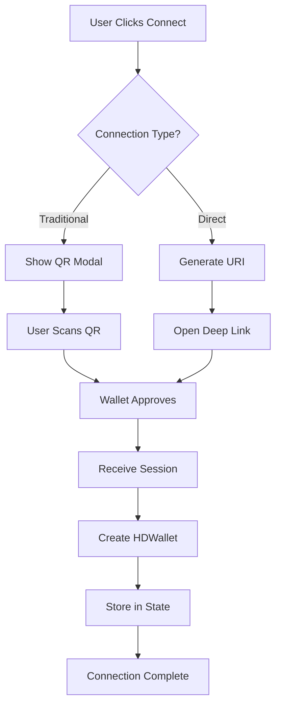

# WalletConnect Wallet - Connecting to External Wallets

This document covers how [ShapeShift web](https://github.com/shapeshift/web) connects to external wallets (MetaMask, Trust Wallet, etc.) using WalletConnect v2.

## Table of Contents
- [Overview](#overview)
- [Connection Methods](#connection-methods)
- [Direct Connection Feature (NEW)](#direct-connection-feature-new)
- [Deep Linking Implementation](#deep-linking-implementation)
- [Platform-Specific Behavior](#platform-specific-behavior)
- [Adding New Wallets](#adding-new-wallets)
- [Technical Implementation](#technical-implementation)
- [Troubleshooting](#troubleshooting)

## Overview

ShapeShift acts as a DApp that connects to users' external wallets via WalletConnect v2. This allows users to:
- Trade and swap assets
- Sign transactions
- Interact with DeFi protocols
- Manage their portfolio

All while keeping their private keys secure in their preferred wallet application.

## Connection Methods

### 1. Traditional QR Code Flow

The standard WalletConnect experience with a modal displaying QR code.

**Flow:**
1. User clicks "Connect Wallet" → Selects "WalletConnect"
2. Modal displays QR code and list of wallet options
3. User scans QR code with mobile wallet OR clicks wallet to open desktop app
4. User approves connection in their wallet
5. ShapeShift receives connection confirmation
6. Wallet is connected and ready for transactions

**Implementation:**
```typescript
// src/context/WalletProvider/WalletConnectV2/config.ts
export const walletConnectV2ProviderConfig = {
  projectId: WALLET_CONNECT_PROJECT_ID,
  showQrModal: true, // Shows the WalletConnect modal
  chains: [1], // Ethereum mainnet (required)
  optionalChains: [10, 56, 100, 137, 8453, 42161, 43114, 42170], // Other supported chains
  optionalMethods: [
    'eth_signTypedData',
    'eth_signTypedData_v4',
    'eth_sign',
    'personal_sign',
    'eth_sendTransaction'
  ]
}
```

[INSERT IMAGE HERE: WalletConnect QR Modal Screenshot]

### 2. Direct Connection Feature (Work in Progress)

**Status:** WIP - [PR #10879](https://github.com/shapeshift/web/pull/10879) → [PR #10912](https://github.com/shapeshift/web/pull/10912)
**Platform:** **Mobile Web Only** (not desktop, not native mobile app)
**Feature Flag:** `VITE_FEATURE_WC_DIRECT_CONNECTION`

Programmatically connect to specific wallets without showing the WalletConnect modal.

**Planned Support:**
- 🦊 MetaMask
- 🛡️ Trust Wallet
- 🌈 Zerion

**How It Works:**
1. User clicks specific wallet button (MetaMask, Trust, or Zerion)
2. ShapeShift generates WalletConnect URI in background
3. Deep link opens the wallet app directly
4. User approves in wallet app
5. Connection completes without modal interaction

[INSERT IMAGE HERE: Direct Connection Buttons Screenshot]

## Direct Connection Feature (Work in Progress)

> **⚠️ Note:** This feature is currently under development ([PR #10879](https://github.com/shapeshift/web/pull/10879) → [PR #10912](https://github.com/shapeshift/web/pull/10912)) and will initially be available for **mobile web only**.

### The Innovation

The key insight is that the WalletConnect modal is **purely UI**. The actual protocol works fine without it:

```typescript
// Traditional approach (with modal)
const provider = await EthereumProvider.init({
  projectId: PROJECT_ID,
  showQrModal: true  // Shows WalletConnect modal
})

// Direct approach (without modal)
const provider = await EthereumProvider.init({
  projectId: PROJECT_ID,
  showQrModal: false  // No modal!
})

// Capture the URI and open specific wallet
provider.on('display_uri', (uri) => {
  const deepLink = `metamask://wc?uri=${encodeURIComponent(uri)}`
  window.open(deepLink, '_blank')
})

// This promise survives app switching!
await provider.enable()
```

### Configuration

**Feature Flag:**
```typescript
// .env.development
VITE_FEATURE_WC_DIRECT_CONNECTION=true  // Will be enabled for mobile web

// .env.production
VITE_FEATURE_WC_DIRECT_CONNECTION=false // Not yet in production
```

**Platform Detection (Planned):**
```typescript
// Will only show on mobile web when feature lands
{isWcDirectConnectionEnabled && isMobileWeb && (
  <WalletConnectDirectRow
    onSetProvider={handleSetProvider}
    onSetLocalWallet={handleSetLocalWallet}
  />
)}
```

### Mobile Magic ✨

The most impressive aspect: the `provider.enable()` promise **survives app switching**:

1. User clicks "MetaMask" button in ShapeShift (browser)
2. Browser shows "Open in MetaMask?" popup
3. User taps "Open" → MetaMask app opens
4. User approves connection in MetaMask
5. MetaMask returns user to browser
6. **The promise resolves!** Connection complete

This works because WalletConnect maintains the session via relay servers, not direct app-to-app communication.

## Deep Linking Implementation

### URL Scheme Patterns

All WalletConnect-compatible wallets follow a standard pattern:

```
{walletScheme}://wc?uri={encodedWalletConnectURI}
```

**Examples:**
- MetaMask: `metamask://wc?uri=wc%3A94caa59...`
- Trust: `trust://wc?uri=wc%3A94caa59...`
- Zerion: `zerion://wc?uri=wc%3A94caa59...`
- Rainbow: `rainbow://wc?uri=wc%3A94caa59...`

### Implementation Details

```typescript
// src/context/WalletProvider/WalletConnectV2/useDirectConnect.ts

const openDeepLink = (walletId: WalletConnectWalletId, uri: string) => {
  // Build wallet-specific deep link
  const deepLink = `${walletId}://wc?uri=${encodeURIComponent(uri)}`

  // Open in new tab/window (triggers app opening on mobile)
  window.open(deepLink, '_blank')
}

// Wallet IDs match their URL schemes (convenient!)
type WalletConnectWalletId = 'metamask' | 'trust' | 'zerion'
```

### iOS vs Android Differences

**iOS:**
- Requires wallet app to be installed
- Shows system prompt: "Safari wants to open MetaMask"
- User must tap "Open" to proceed
- Returns to Safari after approval

**Android:**
- Similar flow with Chrome
- Shows "Open with MetaMask" prompt
- Some browsers may skip prompt if wallet is default handler
- Returns to original browser tab

## Platform-Specific Behavior

### Desktop (localhost development)

✅ **Full WalletConnect support**
- QR codes work normally
- Can test with mobile wallet apps
- Direct connection shows fallback alert with URI

```typescript
if (!isMobile) {
  // Desktop fallback - show URI for manual copying
  alert(`Open your wallet app and paste this URI:\n\n${uri}`)
}
```

### Mobile Web

⚠️ **Requires deployed environment**

**Works:**
- `https://app.shapeshift.com`
- `https://gome.shapeshift.com`
- `https://*.shapeshift.com`

**Doesn't Work:**
- `http://localhost:3000`
- `http://192.168.1.100:3000`
- Local IP addresses

**Why?** WalletConnect relay servers reject connections from local IPs for security.

### Native Mobile App

The ShapeShift mobile app is a WebView wrapper around the web application:

```typescript
// src/App.tsx (Mobile App)
const deepLinkHandler = ({ url }) => {
  // Extract path from deep link
  const path = url.split('shapeshift://')[1]

  // Navigate WebView to web app route
  const newUri = `${SHAPESHIFT_URI}/#/${path}`
  webviewRef.current?.loadUrl(newUri)
}
```

**Supported Schemes:**
- iOS: `shapeshift://`
- Android: `shapeshift://` and `wc://`

## Adding New Wallets

### Step 1: Research Wallet Details

Use the WalletConnect Explorer API:

```bash
# Search for wallet
curl "https://explorer-api.walletconnect.com/v3/wallets?projectId=YOUR_PROJECT_ID&search=rainbow"

# Response includes:
{
  "id": "rainbow",
  "name": "Rainbow",
  "image_id": "7a33d7f1-3d12-4b5c-f3ee-5cd83cb1b500",
  "mobile": {
    "native": "rainbow://",
    "universal": "https://rnbwapp.com"
  }
}
```

### Step 2: Download Wallet Icon

```bash
# Download icon (use image_id from above)
curl "https://explorer-api.walletconnect.com/v3/logo/md/7a33d7f1-3d12-4b5c-f3ee-5cd83cb1b500" \
  -o src/assets/rainbow-wallet.png
```

### Step 3: Update Configuration

```typescript
// src/context/WalletProvider/WalletConnectV2/constants.ts

// 1. Add to union type
export type WalletConnectWalletId =
  | 'metamask'
  | 'trust'
  | 'zerion'
  | 'rainbow'  // NEW

// 2. Import icon
import RainbowIcon from '@/assets/rainbow-wallet.png'

// 3. Add to wallet configs
export const WALLET_CONFIGS: WalletConfig[] = [
  // ... existing wallets
  {
    id: 'rainbow',
    name: 'Rainbow',
    imageUrl: RainbowIcon,
  }
]

// Deep link automatically built from ID: rainbow://wc?uri=...
```

### Step 4: Test

1. **Build and deploy** to test environment
2. **Test on real device** with wallet installed
3. **Verify deep link** opens correct wallet
4. **Check connection** completes successfully
5. **Test transactions** work properly

## Technical Implementation

### File Structure

```
src/context/WalletProvider/WalletConnectV2/
├── config.ts                           # Provider configurations
├── constants.ts                        # Wallet definitions
├── useDirectConnect.ts                 # Direct connection logic
├── useWalletConnectV2EventHandler.ts  # Event handling
└── components/
    ├── Connect.tsx                     # Traditional modal UI
    └── WalletConnectDirectRow.tsx      # Direct buttons UI
```

### State Flow



### Key Components

**EthereumProvider** (from `@walletconnect/ethereum-provider`)
- Manages WalletConnect session
- Emits connection events
- Handles RPC requests

**HDWallet Wrapper** (from `@shapeshiftoss/hdwallet-walletconnectv2`)
- Provides unified wallet interface
- Abstracts WalletConnect specifics
- Integrates with ShapeShift's wallet system

**State Management**
```typescript
// Wallet state stored in Redux
dispatch({
  type: WalletActions.SET_WALLET,
  payload: {
    wallet: hdWallet,
    name: 'WalletConnect',
    icon: walletIcon
  }
})

// Local storage for persistence
localWallet.setLocalWallet('walletconnect', connector)
```

### Security Considerations

1. **Encrypted Communication**: All WalletConnect traffic is encrypted
2. **No Private Keys**: ShapeShift never receives private keys
3. **Session Management**: Sessions cleared on wallet change
4. **Origin Verification**: Wallets show requesting domain
5. **Transaction Preview**: Tenderly simulation before signing

## Troubleshooting

### Connection Issues

**Problem:** "Deep link doesn't open wallet app"
- **Solution:** Ensure wallet is installed on device
- **Check:** Testing on real device, not simulator
- **Verify:** Using deployed URL, not localhost

**Problem:** "Connection times out"
- **Solution:** Check network connectivity
- **Try:** Switching between WiFi/cellular
- **Verify:** WalletConnect relay is accessible

**Problem:** "Buttons don't appear"
- **Solution:** Enable feature flag
- **Check:** `VITE_FEATURE_WC_DIRECT_CONNECTION=true`
- **Note:** Currently development-only feature

### Development Tips

1. **Use ephemeral environments** for mobile testing
   ```bash
   # Deploy to test environment
   git push origin feature/my-branch
   # Access at: https://[branch-name].shapeshift.com
   ```

2. **Debug with console logs**
   ```typescript
   provider.on('display_uri', (uri) => {
     console.log('WalletConnect URI:', uri)
   })
   ```

3. **Test wallet detection**
   ```javascript
   // Check if wallet is available (mobile browsers)
   if (window.ethereum?.isMetaMask) {
     console.log('MetaMask detected')
   }
   ```

## Performance Optimization

### Connection Caching
- WalletConnect sessions persist in localStorage
- Automatic reconnection on page refresh
- No need to re-approve in wallet

### Lazy Loading
- WalletConnect SDK only loaded when needed
- Direct connection components code-split
- Icons loaded on-demand

### Mobile Optimizations
- Reduced bundle size for mobile web
- Efficient deep link handling
- Minimal re-renders during connection

## Future Enhancements

### Planned Features

1. **Wallet Detection**
   - Detect installed wallets on device
   - Show only available wallets
   - Fallback to QR for missing wallets

2. **Smart Routing**
   - Auto-open wallet for transaction signing
   - Return to ShapeShift after signing
   - Seamless multi-step flows

3. **Extended Wallet Support**
   - Add more popular wallets
   - Support for hardware wallets
   - Multi-wallet connections

### Experimental Ideas

- **Progressive Web App**: Install ShapeShift as PWA for better deep linking
- **Universal Links**: Use HTTPS URLs instead of custom schemes
- **Wallet Aggregation**: Connect multiple wallets simultaneously

## Best Practices

### For Users

1. **Keep wallets updated** for best compatibility
2. **Use secure networks** when connecting
3. **Verify connection domain** in wallet
4. **Disconnect when not in use** for security

### For Developers

1. **Test on real devices** with actual wallets
2. **Handle edge cases** (timeout, rejection, errors)
3. **Provide fallbacks** for unsupported scenarios
4. **Log connection events** for debugging

## Resources

### Documentation
- [WalletConnect v2 Specs](https://specs.walletconnect.com/2.0/)
- [Deep Linking Best Practices](https://docs.walletconnect.com/2.0/mobile/deep-linking)
- [Explorer API Reference](https://docs.walletconnect.com/api/explorer)

### Code References
- [useDirectConnect.ts](../../src/context/WalletProvider/WalletConnectV2/useDirectConnect.ts) - Direct connection implementation
- [WalletConnectDirectRow.tsx](../../src/context/WalletProvider/WalletConnectV2/components/WalletConnectDirectRow.tsx) - UI component
- [constants.ts](../../src/context/WalletProvider/WalletConnectV2/constants.ts) - Wallet configurations

### Testing Tools
- [WalletConnect Test Wallet](https://test.walletconnect.com/) - For development
- [ngrok](https://ngrok.com/) - Tunnel localhost for mobile testing
- [Browser DevTools](chrome://inspect) - Debug mobile browsers

---

*Last Updated: October 2025*
*Feature Status: Direct Connection in Development (Flag: `VITE_FEATURE_WC_DIRECT_CONNECTION`)*